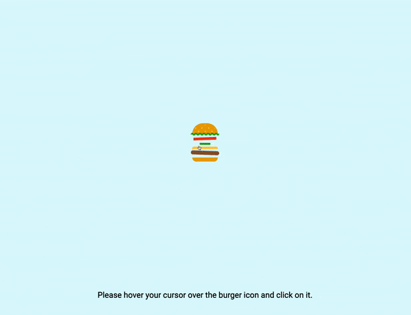

# 🍔 Animated Burger Button

This project features an animated burger button, showcasing CSS animations and hover effects.

## 📦 Technologies

Built with:

- `HTML:` Markup language for creating the structure.
- `CSS:` For styling and animations.

## ⚙️ Getting Started

To view and interact with the animated burger button:

1. Download the project files.
2. Open the `index.html` file in Visual Studio Code.
3. Use the Live Server extension in VS Code to view the project in your web browser.

## 🖱️ Interaction

Hover over and click the burger button to see the animations in action.

## 🛣️ Project Structure

Here are the key files and their purposes:

- **index.html**: The main HTML file containing the structure of the burger button.
- **style.css**: The CSS file that styles the burger button and adds animations.

Feel free to explore and customize these files to suit your needs!

## 📱 Responsive Design

- The animated burger button is responsive, ensuring a seamless experience on both desktops and mobile devices.

## 🔄 Animations

The burger button features various CSS animations that activate on hover and click events. Here’s an overview:

- **Bun**: Animates with a rotation effect.
- **Lettuce**: Animates with a sliding effect.
- **Tomato**: Wriggles slightly.
- **Pickles**: Switch positions.
- **Cheese**: Rotates dynamically.
- **Patty**: Wriggles slightly.
